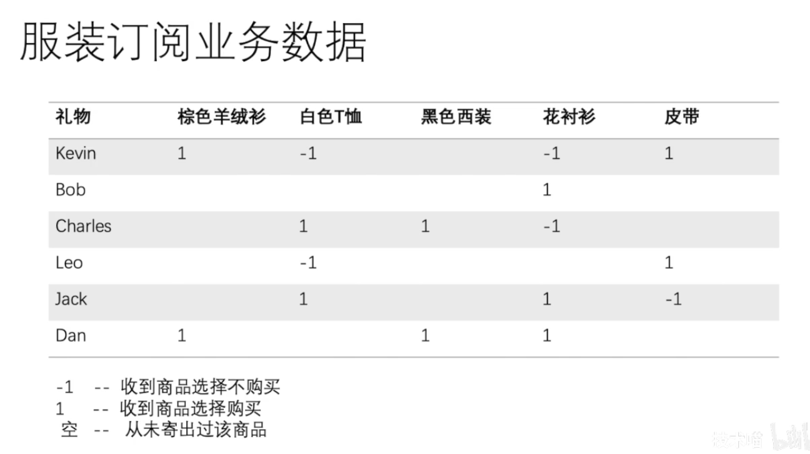
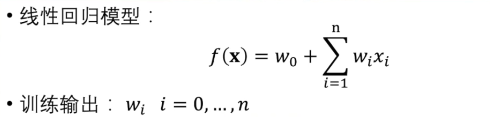
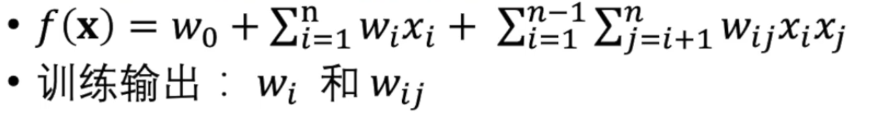
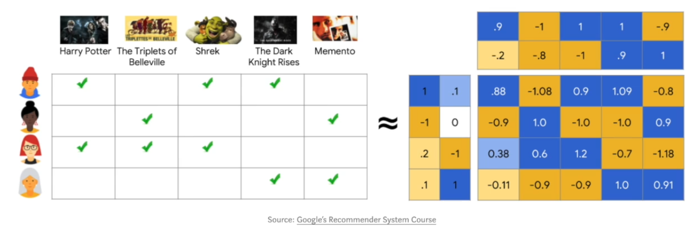
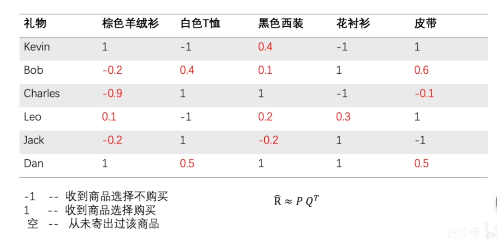
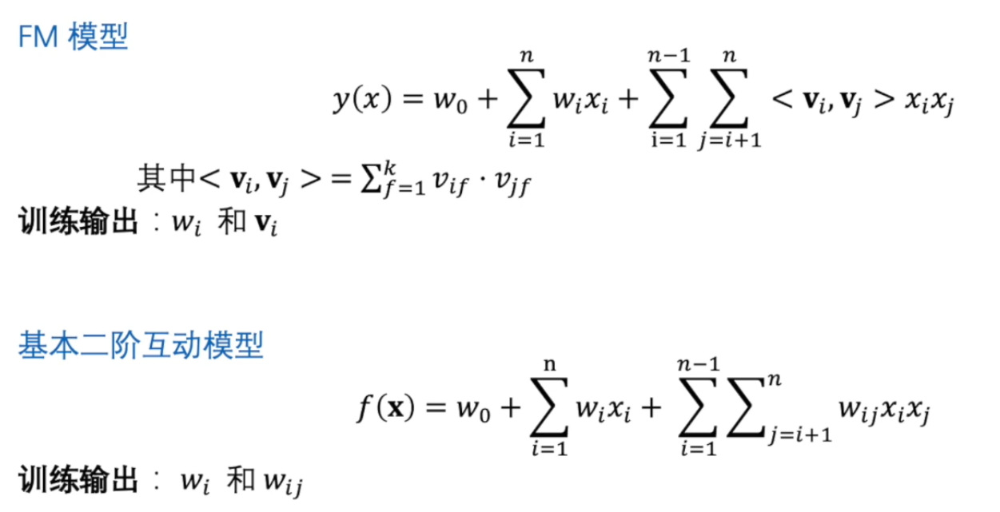
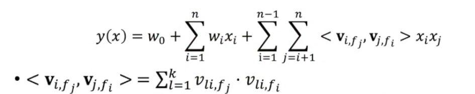
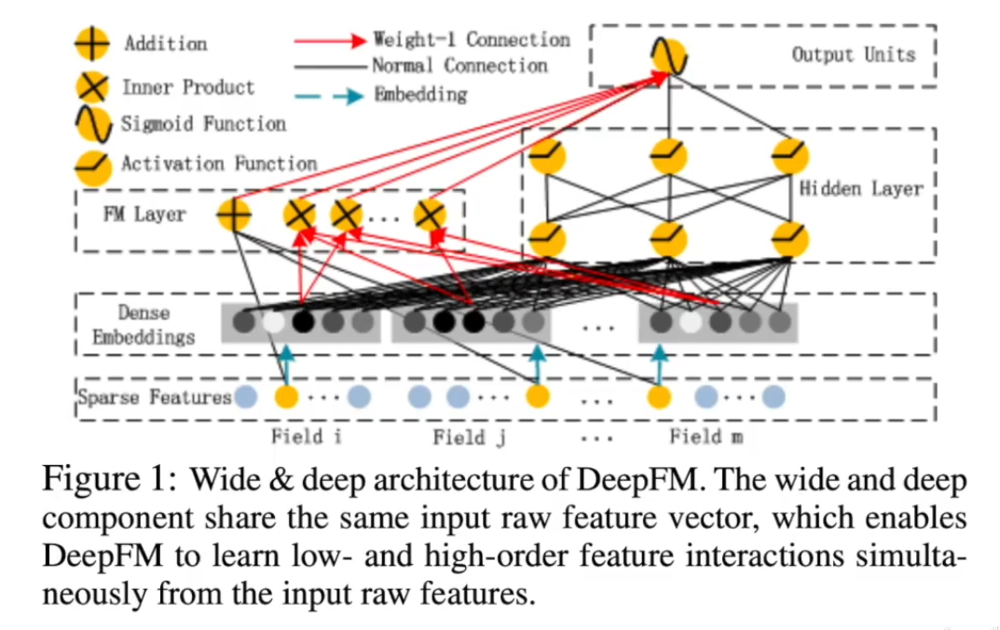

# Factorization Machine 因子分解机

libfm——FM

## 简介

 一种解决大规模稀疏数据下的特征组合问题的机器学习模型

常见应用场景：推荐算法，例如在电商推荐产品——用户真实可用购买的只有几百万分之一——用户对产品喜好的数据很稀疏

广告推荐系统——选择用户喜好的广告投放——点击广告也是很稀疏的事情

目标：预测用户会喜欢什么——每个月寄什么

## 线性回归 LR

Xi为衣服（布料，花色...）或者用户（年龄，性别...）的特征

w为机器学习的结果

特征之间的互动比较低，例如某个用户就是很喜欢运动衣服，因此用户的“喜好运动”的特征和衣服的“运动服”特征就应该联系再强一点

因此考虑将某些特征乘起来变成新的特征

## 矩阵完全化

新问题：有些商品从来没给用户发过，几乎没有数据，xi*xj几乎为0，但也不能认为这个商品不好

怎么解决稀疏的问题？

矩阵完全化：补充没有值的地方，进行矩阵分解，使得分解后的矩阵乘积和已知数据能够精准对应

 

## FM模型

<vi,vj> 内积，一个k维向量——每一个特征都会变成一个k维向量然后再累积

和矩阵完全化相似之处：观测查看隐空间（latent space，低维度的稠密空间）的数据，观测空间可能是稀疏的吗，投影到低维度就可能稠密了

 

## FFM模型

Field  Factorization  Machine

因为用户和用户之间的特征 & 用户和商品之间的特征 可能互相之间的相关性是不同的相关性，交互性质的不一样

FM无法表达不同的交互

FM中每个特征都会变成一个k维向量，FFM中每个特征会变成不同的k维向量和不同的向量交互

灵活度增加了，但可能会overfitting（过拟合）

## 模型缺点

对特征的刻画比较浅

层数太浅

## 模型改进

Deep FM

神经网络和FM的结合（互补）

左边是FM，右边是神经网络。

Dense Embedding 

