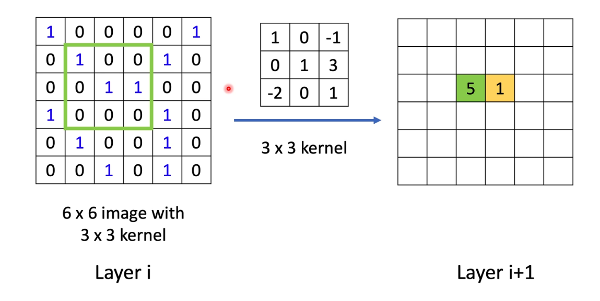

# B站-GNN

graph neural network

https://www.bilibili.com/video/BV1Tf4y1i7Go?spm_id_from=333.999.0.0

点包含点本身的信息；边包含点和点之间的关系。

1，**聚合**

为什么要有邻居信息：近朱者赤近墨者黑

2，**更新**

则A的信息可以看成：

对A的信息进行更新：和邻居节点结合

3，**循环**

顾名思义

一次的话，A的信息可能只包含ABCD，如果两次循环就可以迭代到E

---

1、对点进行预测，可以判断用户是否是垃圾用户

本项目，节点分类。二分类，有什么风险。

2、对边进行预测，预测两个节点之间是不是有边。推荐系统就可以预测出适合用户的商品

3，聚类

4，计算节点之间的相似度，两个用户/商品的相似度

-----

# 台大李宏毅_GNN

https://www.bilibili.com/video/BV1G54y1971S?from=search&seid=5756179119543261290&spm_id_from=333.337.0.0

## introduction

可以做什么问题：

1. 分类问题
2. 是否问题（二分类）
3. Generation（演化、进化）

既考虑了自己的特征，又考虑了和其他样本的特征。

如何利用仅有的label，如何向相邻节点进行学习？

如何在图上做卷积？

dataset太小的时候很容易出现overfit

benchmark：衡量不同的模型的基准。

## spatial-based GNN

回忆一下CNN的计算过程：

例如下面第i层神经网络经过中间那个kernel卷积，就得到绿色部分的5。对应相乘相加

这种方法如何到GNN？

更新，聚合

NN4G

邻居加起来，再加上原本的input特征

如何聚合？

直接将每一层的结果加权再加起来。

DCNN

将和3这个节点距离为1的加起来再取平均（Mean），再做一个weight transform

下一层加与这个节点距离为2的。

这样将每个节点的特征提取出i层，构成i个矩阵，再结果weight transform就得到它的node feature

DGC

和上一个的区别在于这个最后是直接加起来。

MoNET

## Graph Signal Processing and Spectral-based GNN

## Graph Generation

## GNN for NLP

# 图聚类算法

## 1、MCL算法

https://blog.csdn.net/lovebyz/article/details/94000289

这是一个加权无向图

邻接矩阵：（无权图就是01）

概率矩阵：分子为i到j的边权，分母为所有点到j的边权

之后的计算为：P2=P1*P1；P3=P2 *P1；...最终求到Pn不再变化为止。

每一列的和为1——》导致最后的Pn矩阵每一行可能数据都一样

在实际操作中，为了避免一些bug，也要添加自己到自己的边权。

下面是一个例子

输入：一个非全连通图，**Expansion** 时的参数e和 **Inflation** 的参数r。（r越大，粒度越小）

e=2，r=2

 \6. 重复步骤5和6，直到达到稳定

 \7. 将结果矩阵转化为聚簇

不适合在大图上使用（它的算法复杂度是O(N3)O(N3)）

## 2、SCAN算法

https://dl.acm.org/doi/pdf/10.1145/1281192.1281280

https://blog.csdn.net/weixin_44936889/article/details/106455436

算法特点：解决大多数图分类算法没有处理的桥接集群的顶点（桥节点）和与集群有少量连接的顶点（离群点）。

识别桥节点：在病毒传播和流行病学等应用程序是非常重要的，因为桥节点往往负责传播思想或疾病。

离群点：可以作为数据中的噪声进行隔离。
算法特点是：速度快，效率高，每个顶点只访问一次。

该算法**使用顶点的邻域作为聚类标准**，而不是只使用它们的直接连接。按照它们共同邻域的方式分组到集群中。

6（一个桥节点，将其划分到在任何一个集群中都是有争议的）或顶点13（一个离群点，它只与网络有一个连接）

### 基础概念

节点相似度：节点相似度定义为两个节点**共同邻居的数目**与**两个节点邻居数目的几何平均数**的比值（这里的邻居均包含节点自身）。Γ(x) 表示节点 x 及其相邻节点所组成的集合。

ϵ - 邻居：节点的 ϵ-邻居定义为与其**相似度不小于 ϵ 的节点**所组成的集合。

核节点：核节点是指 **ϵ-邻居的数目大于 μ 的节点**。

直接可达：节点 w 是核节点 v 的 ϵ-邻居，那么称从 v 直接可达 w。

可达：存在节点路径可以到达

相连：若核节点u可达节点v和节点w，则称节点v和节点w相连.

相连聚类：如果一个非空子图C中的所有节点是相连的，并且C是满足可达的最大子图，那么称C是一个相连聚类。

桥节点：与至少两个聚类相邻的孤立节点。

离群点：只与一个聚类相邻或不与任何聚类相邻的孤立节点。

引理：

1. 如果 v 是一个核节点，那么从 v 可达的节点集是一个结构相连聚类。
2. C 是一个结构相连聚类， p 是 C 中的一个核节点。那么 C 等于从 p 结构可达的节点集。

## 步骤

- 在开始时，所有的顶点都被标记为非分类的。扫描算法对每个顶点进行分类，要么是集群的成员，要么是非成员。
- 对于尚未分类的每个顶点,扫描检查是否这个顶点的核心（STEP 1）。
- 如果顶点是核心，则从这个顶点拓展一个新的集群（STEP 2.1）。否则，顶点标注为非成员（STEP 2.2）。
- 为了找到一个新的集群，从任意核心 v 搜索所有可达顶点。由于引理2，这足以找到包含顶点 v 的完整集群。

在STEP 2.2中，会生成一个新的集群ID，该ID将分配给STEP 2.2中找到的所有顶点。

SCAN首先将顶点 v 的所有其 ϵ-邻居放进队列中。对于队列中的每个顶点，它计算所有直接可达的顶点，并将那些仍未分类的顶点插入队列中。重复此操作，直到队列为空。

## pSCAN算法

https://ieeexplore.ieee.org/abstract/document/7812808/

https://blog.csdn.net/weixin_44936889/article/details/106592445

