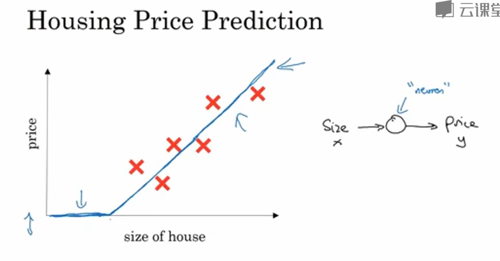
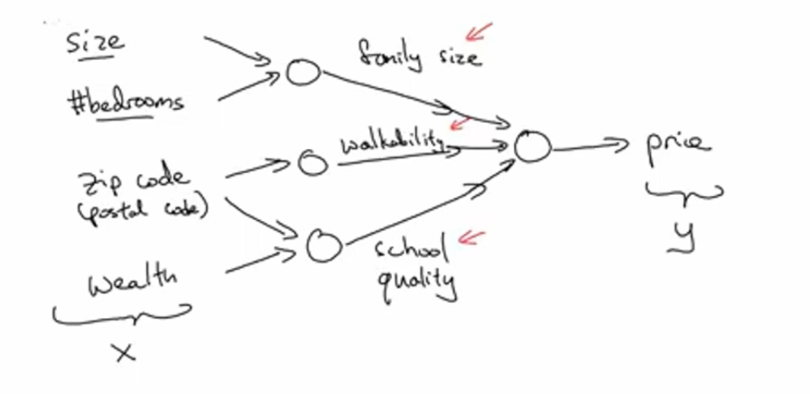
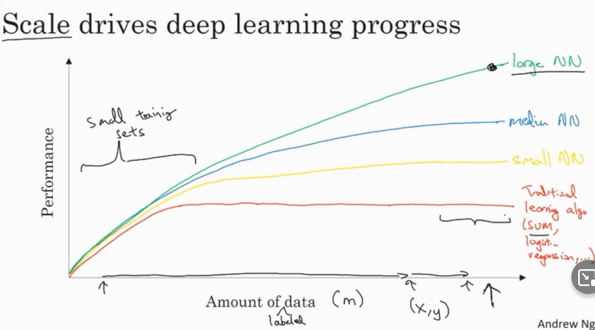
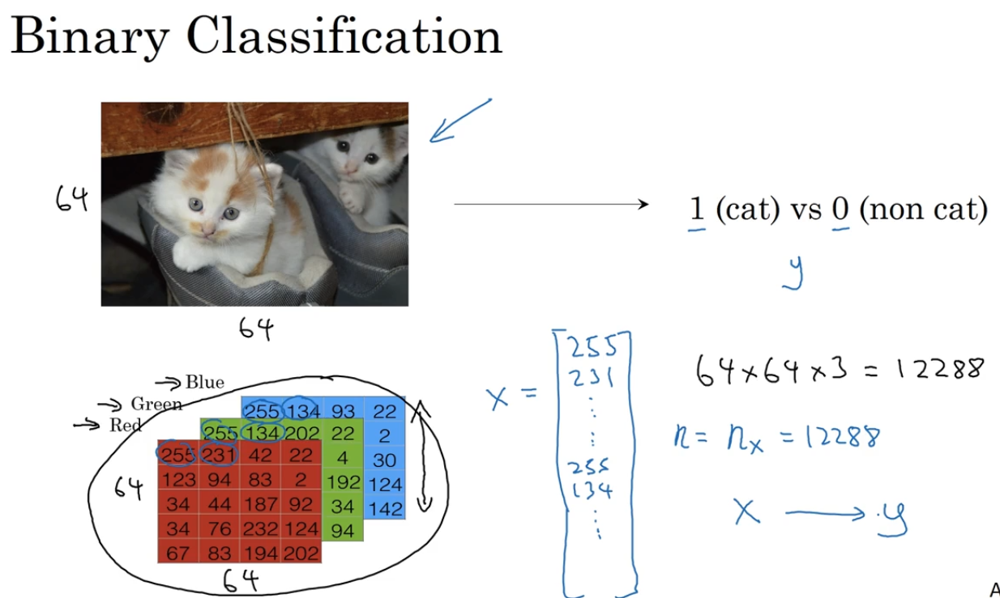
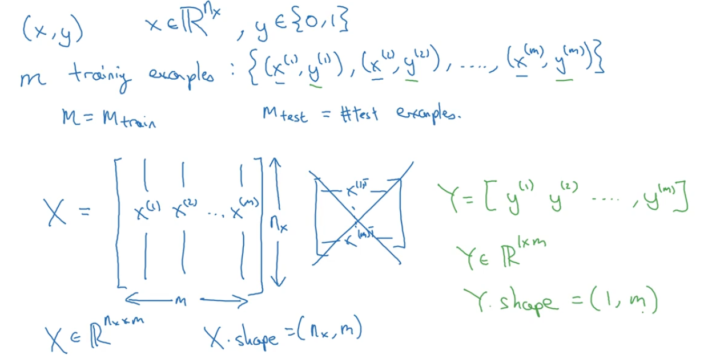
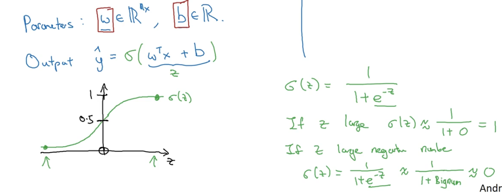
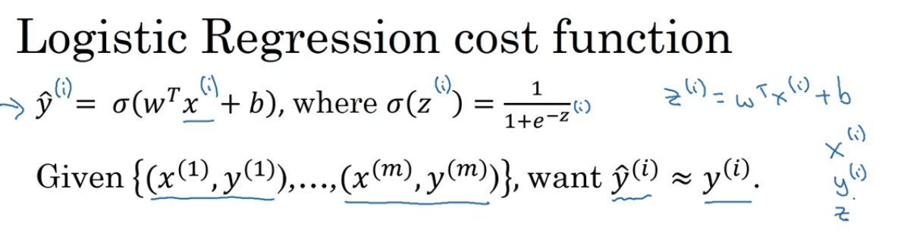
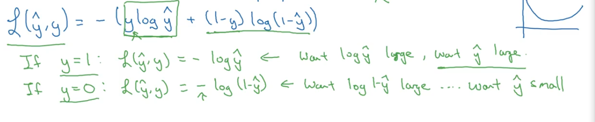
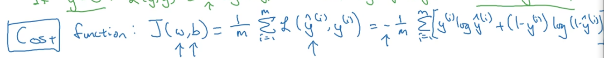

https://www.bilibili.com/video/av926316362?from=search&seid=15203057011498905069&spm_id_from=333.337.0.0

# 深度学习概论

## 什么是神经网络

一个最简单的神经网络。这里这个线性回归就是一个节点，就是一个神经元。

这个先平后斜的线就叫做ReLU：修正线性单元。

以上面的为基础，可以根据其他特征构建稍微大一点的神经网络

神经网络的使用：只需要给出输入所需要的x，网络就会输出y，其中的中间过程它会自己完成。

神经网络分类：标准神经网络，卷积神经网络（常用于图像），循环神经网络（常用于时间序列相关）

输入数据分类：结构化数据，非结构化数据（例如音频、图像）

神经网络为什么开始流行：由于大数据

# 神经网络基础

## 二分分类

logistic回归用于二分类

假设图片是64*64像素，则输入的x向量规模就将是64* 64*3

x为n维向量，y为0或1

假设有m个训练集，则X和Y可以分别这样表示：

.shape是python中的一个函数

## logistic回归

可以看成一个小小的

普通的线性回归基于y=kx+b函数，而logistic回归基于sigmoid函数：1/1+e^-z

这个函数可以很好地把输出y的范围

为了求出w和b，需要定义一个成本函数

带hat的是预测值，则logistic回归可归约为下面的问题：

损失函数：用来衡量预测值和真实值之间的差距，不一定是一次函数

logistics**损失函数**如下

下面两行绿色的分别讨论了真实值为1和0的情况，注意这里y的预测值是被sigmoid函数限定在0和1之间的。

成本函数是损失函数的加权和：

我们的目的就是使得成本函数尽可能小。

# 浅层神经网络

# 深层神经网络

