学习资料来源：B站up主‘技术喵’

https://space.bilibili.com/613071673/search/video?keyword=%E7%A5%9E%E7%BB%8F%E7%BD%91%E7%BB%9C

# 最简单的神经网络

函数的表达式，计算的单元

人工神经网络：ANN（Artificial Neural Networks）

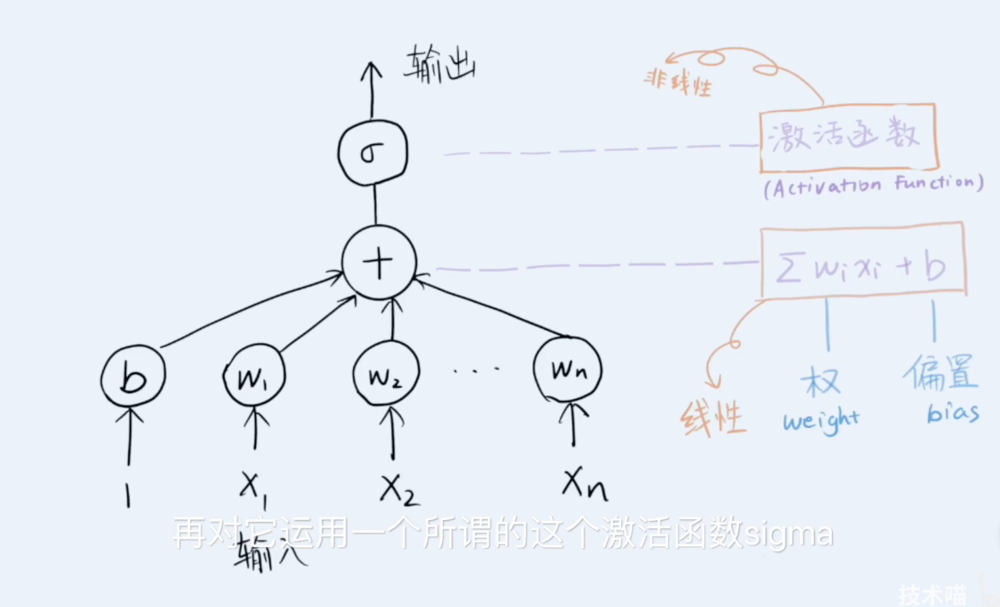

有n个输入和一个偏置b加起来放到一个激活函数sigma得到一个输出。sigma是多样的，不一定是线性的，所以可以得到多种多样的输出。

最简单的就是一个神经元构成的神经网络，甚至激活函数也可以是最简单的一个step change——阶跃。很像logistic regression（逻辑回归）。

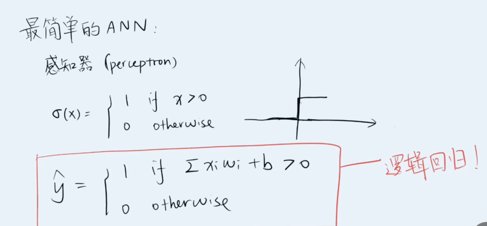

这种最简单的神经网络又叫感知器（perceptron）

# 多层神经网络

多层神经网络和泰勒展开式（不断展开再结合，最终到一定程度后就和原函数相差无几了）的思路很像：不断增加神经元，这些神经元之间的连接会模拟出一个函数——接近本身函数。

多层神经网络的抽象：

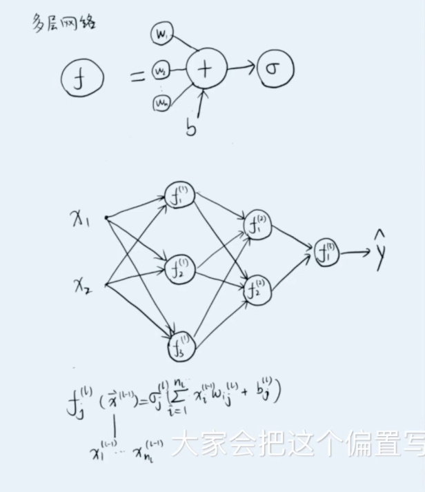

此时的偏置就写在神经元里了。

图中第一层有三个隐藏神经元，第二层有两个，输出层有一个神经元，最终得到输出。

只要不是输入层和输出层，那么中间就叫做隐藏层

# sigma激活函数

常见的几种：

- sigmoid function

最初经常用，但会出现梯度弥散的问题（梯度的值越来越小最后消失的问题，训练就停止了、没办法再训练）

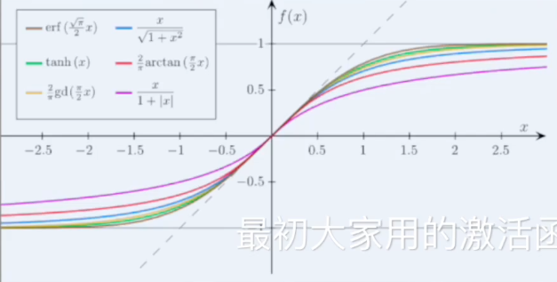

- ReLU

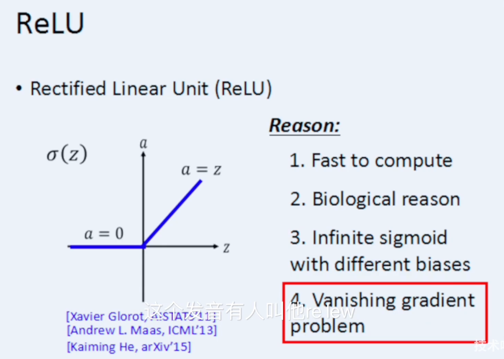

主要特色：可以解决梯度弥散的问题

由于小于0的时候取值就是0，会对神经网络进行一定的稀疏化，也就是说有些神经元以后就没用了——好处：某种意义上起到了regularization的作用，坏处：神经元死了可能就再也没办法激活了。

对应的变形：leaky relu，randomized leaky relu

keras激活函数连接：https://keras.io/api/optimizers/

*Keras*是一个由Python编写的开源人工神经网络库，可以作为Tensorflow、Microsoft-CNTK和Theano的高阶应用程序接口，进行深度学习模型的设计、调试、评估、应用和可视化。

# 随机梯度下降算法SGD

stochastic  gradient descent algorithm

梯度：对于每个参数的导数组合成一个向量

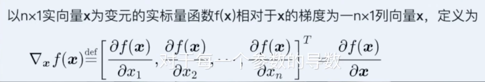

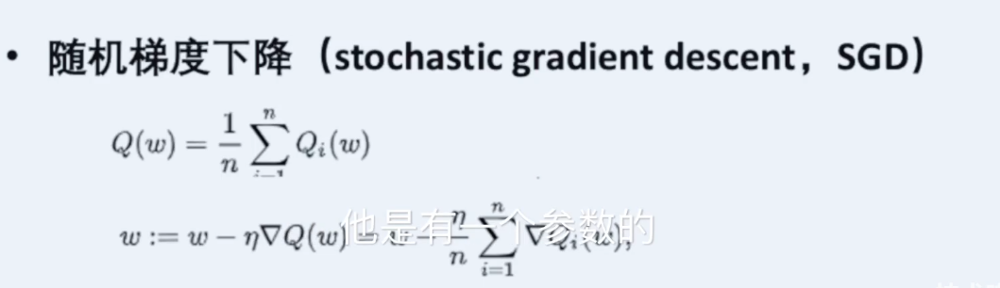

Qw是对所有样本损失函数的一个平均

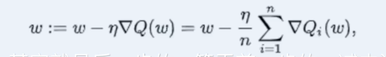

后一步的w等于前一步的w减去eta乘以梯度

batch SGD：将数据分成一块一块，对每一块进行处理

p1 13:34

很多变型：常用adam和rmsprop算法

关键：收敛能力，如果学习速率过大可能产生一些震荡

随机梯度算法针对凹函数或者凸函数是一定可以收敛到最优值的——防止卡在局部最优点

# 卷积神经网络CNN

CNN：convolutional Neural network

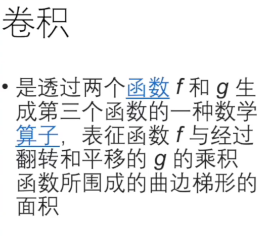

卷积：通过两个函数f和g生成第三个函数的算子

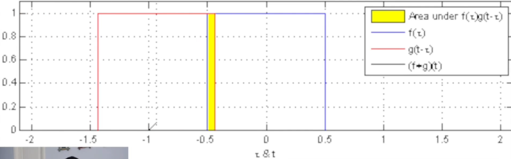

动图里面红色框框向右移动，和蓝色框框黄色部分的面积：此时刚有，因此直线只露尖尖角。

历史悠久：1980年，用于图像处理

人类视觉处理远远快于电脑：因此考虑仿生视觉皮层

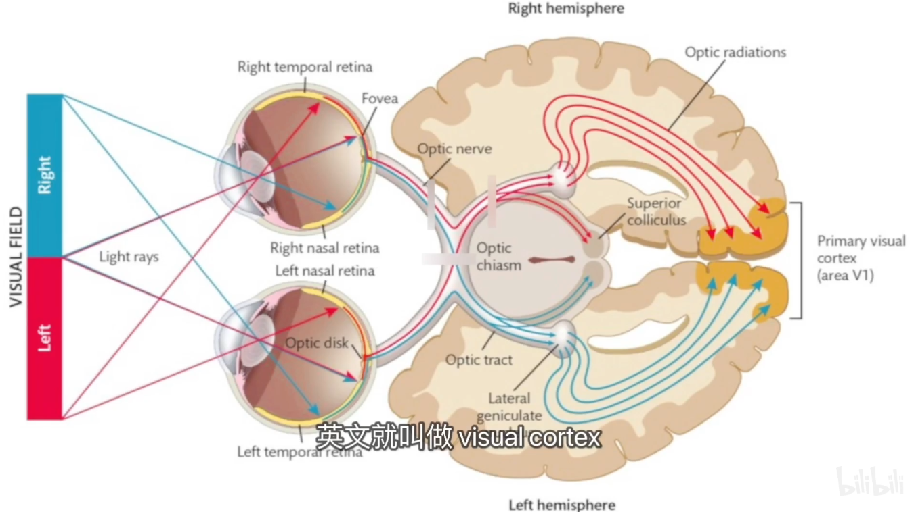

视觉皮层有两种接收器：一种只对于水平信号有反应，一种只对于垂直信号有反应

同时有一些接收器很小，有一些很大，实际上是两者在一起工作的。

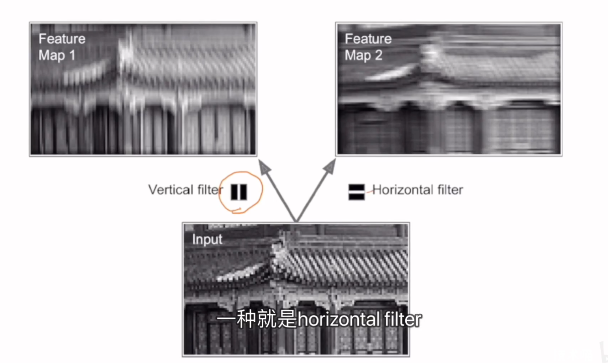

而普通前馈神经网络是将图片扁平化，变成了一条信息：

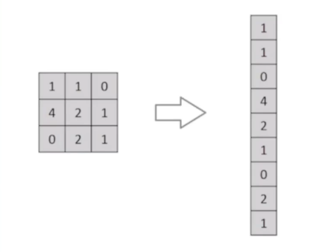

而卷积神经网络如下：

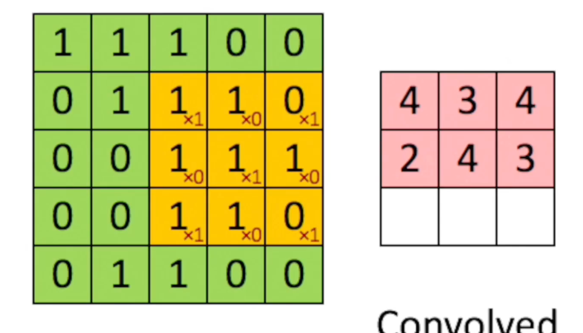

这是一个灰度图像（只有一个数字表示像素点），黄色区域表示一个滤波器，不停的挪动滤波器，就会得到右边。这种滤波器在卷积网络中又叫做kernel：核。

RGB图像的卷积如下：

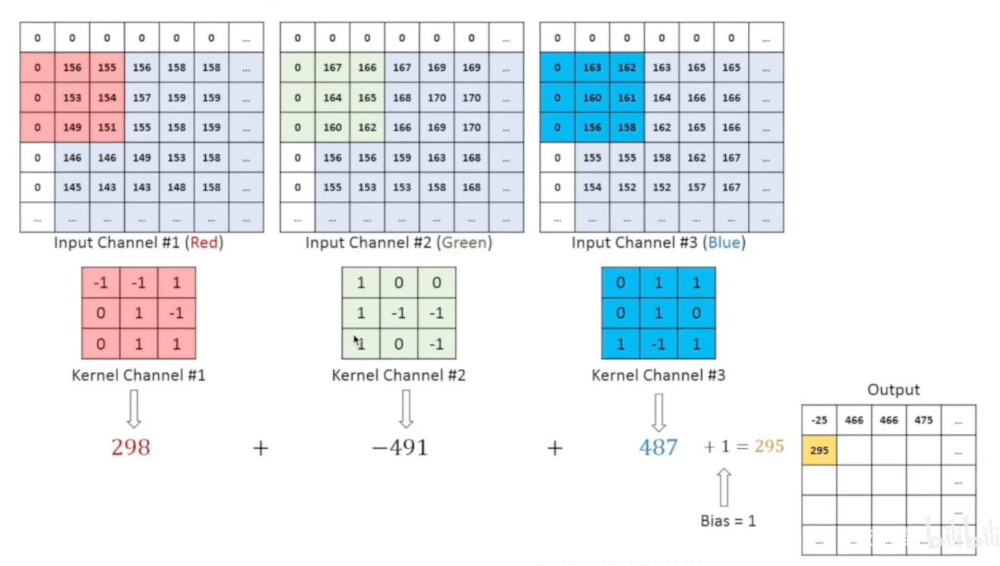

都是3*3 *3 ，但是滤波器本身还会加一个维度：

i行j列第k个特征，在某一个卷积层的输出，是激活函数之前的那个输出

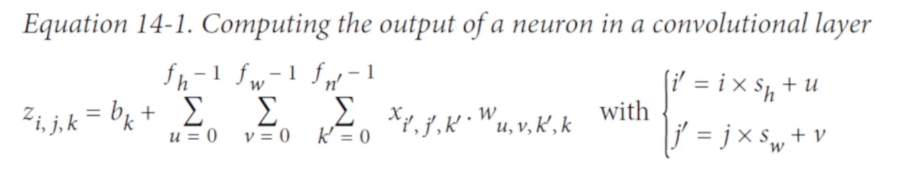

b，w为需要训练的参数——某个特定的滤波器需要的参数

fh是核的高，fw是核的宽度，fn‘是这一层卷积输入的特征数。每一个都乘起来再加上偏置，就得到特定神经元的输出

# 循环神经网络RNN

也是在降维：卷积在利用空间上的信息重复性，而循环神经网络则是在利用·时间上

同一个网络的结构，一个输出可以成为另一个的输入

卷积：对人类视觉的模拟。

循环：对人类记忆的模拟，处理语言信息——基于对过去的理解。没有确定的输入输出维度，在时序上变化的量。

通过看序列之间的相关性，产生一定程度上的记忆，从而达到可以处理变化的输入

应用：预测时序信号的未来，股票价格，**自然语言的处理**。

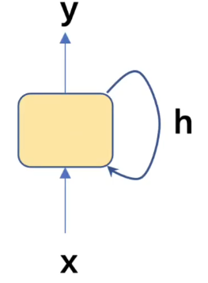

最简单的循环神经网络：xyh都是向量，h即是输入有是输出

展开后：

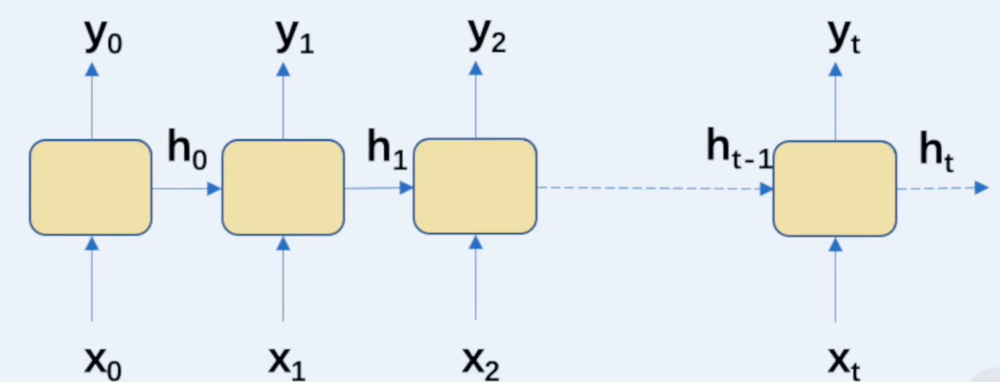

Deep RNN

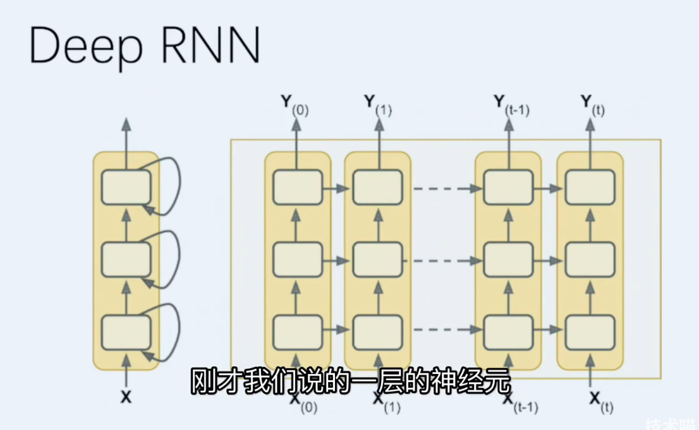

更多层的，将一层变成多层。

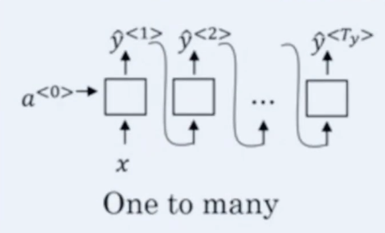

一个x，输出很多y。

例如给一个音符，创造一个歌曲。

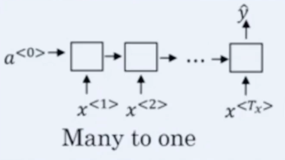

股票预测，自动驾驶碰撞检测。

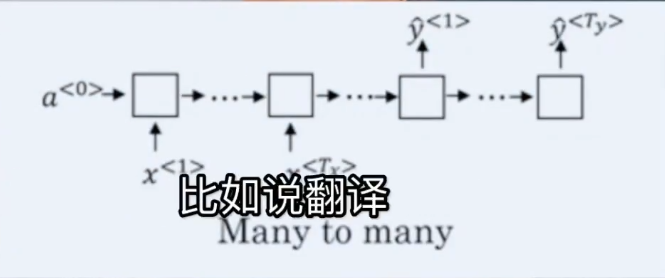

例子：翻译

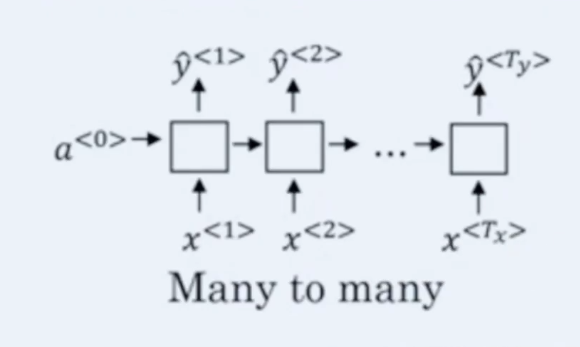

自动驾驶，每一个时刻都有一个输入一个输出

普通循环神经网络对长期记忆丢失很快。

LSTM：长短期记忆

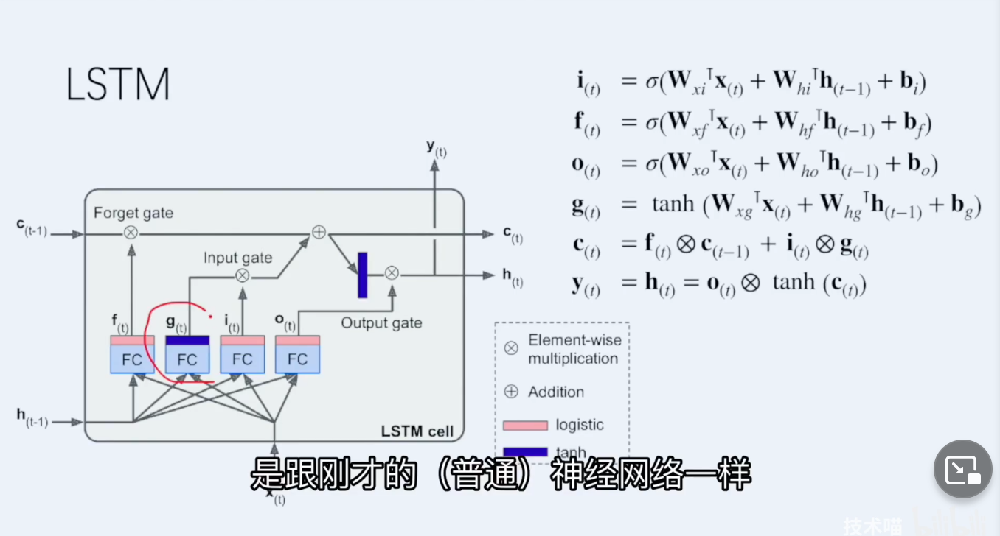

gt就是一个sigmoid函数，没有使用relu：

gt是正常循环神经网络决定，像是短期记忆

ct：长期记忆，保存了ct-1

ft：长期记忆，有遗忘系数，如果长期记忆影响不，就会调低。

GRU cell

带有门的循环单元，砍掉了f

少了全连接层

双向循环神经网络

前后都有关系。

RNN最大的挑战

不能使用relu，因为是同一个参数走了很多层，会梯度爆炸，梯度不稳定。

增加稳定性：batch normalization 平均值和方差固定到某个范围，再输出到下一层。——但不太适用于RNN，不关心某个词是不是normal，而是我的句子是不是normal

因此有layer normalization

绿色的embedding就是将一个非常稀疏的信号（这里面句子的词实际上非常稀疏），投影到一个稠密的空间

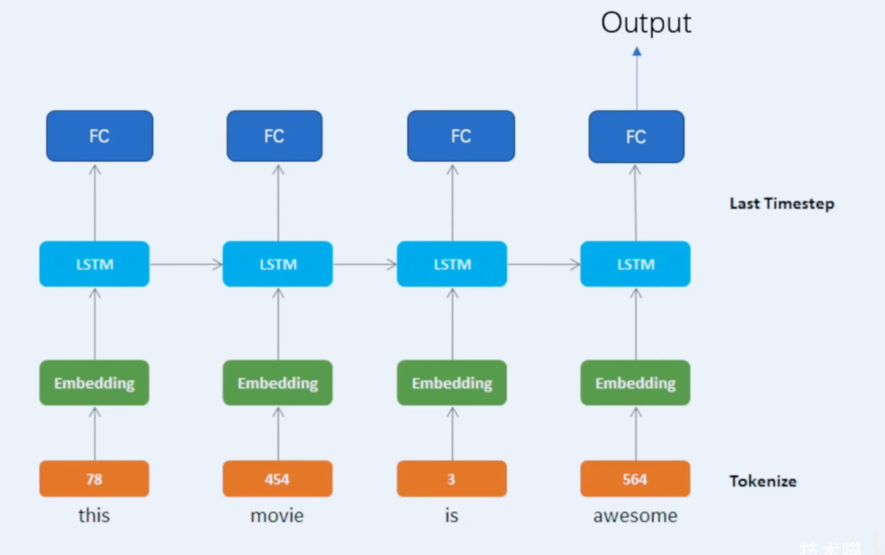

# 注意力机制

注意力：对有限资源的一种分配。人的视觉信息只有1%能够被大脑完全利用——自身存在的注意力机制。

是一个框架，不是一个具体的网络架构。

神经注意力机制可以使得神经网络具备专注于其输入（或特征）子集的能力：选择特定的输入。注意力可以应用于任何类型的输入而不管其形状如何。在计算能力有限情况下，注意力机制（attention mechanism）是解决信息超载问题的主要手段的一种资源分配方案，将计算资源分配给更重要的任

用于解决编码容量瓶颈以及长距离依赖：例如神经机器翻译&图像描述生成

# 嵌入与表示学习

embedding and representation learning

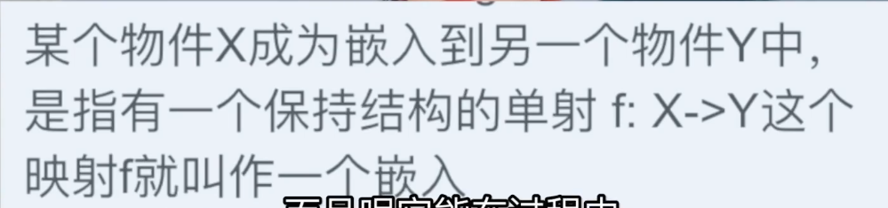

并且过程中y结构不变。

选择什么样的结构进行嵌入，使得嵌入过程中最重要的结构不会丢失

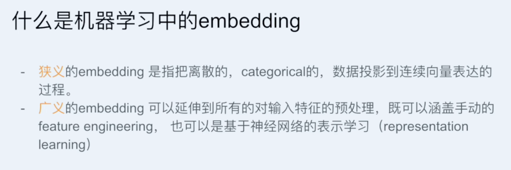

例如：把几百万种商品嵌入到几百种类目种。

表示学习：自动嵌入。

**把离散的高维的东西转换成聚合的低维的信息。**

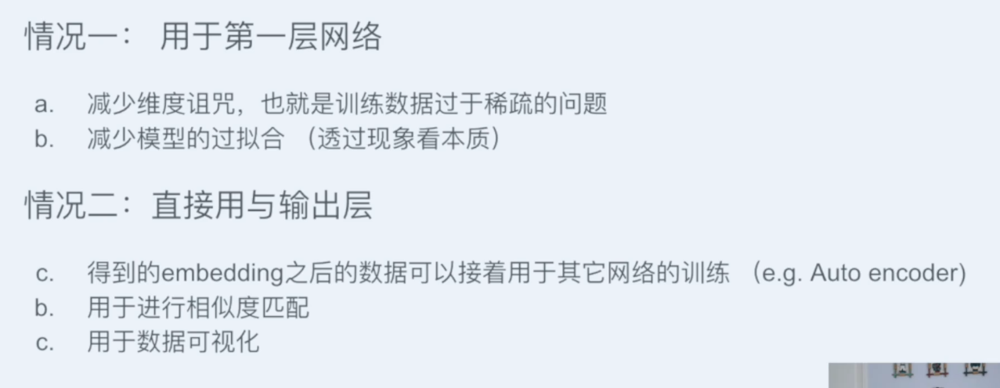

这个世界是非常简单的，所以可以把所有的东西投影到一个低维的空间然后再去理解它。

科学是我们解释世界的一种体系和一种理论，是信仰的一种。

